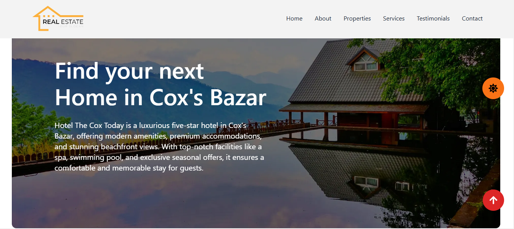

<<<<<<< HEAD
# 🏡 Real Estate Web App

A modern and responsive real estate web application built with **React.js** and **Tailwind CSS**. This project aims to provide users with an intuitive interface to browse, search, and filter property listings seamlessly.

## 🚀 Features

- **Modern UI/UX** – Designed with Tailwind CSS for a sleek and responsive interface.
- **Reusable Components** – Modular React components for the header, footer, property listings, and more.
- **Dynamic Property Listings** – Fetches real estate data from an API and displays it dynamically.
- **Advanced Search & Filtering** – Users can refine their search based on property type, location, price range, and more.
- **Pagination Support** – Optimized navigation for large datasets.
- **Deployment Ready** – Can be hosted on platforms like Vercel.

## 🛠️ Tech Stack

- **Frontend:** React.js, Tailwind CSS
- **Data Fetching:** Fetch API / Axios
- **State Management:** useState, useEffect, Context API (if needed)
- **Deployment:** Vercel
  
## 📸 Project Preview

=======
>>>>>>> 992c4d9 (updated file)
